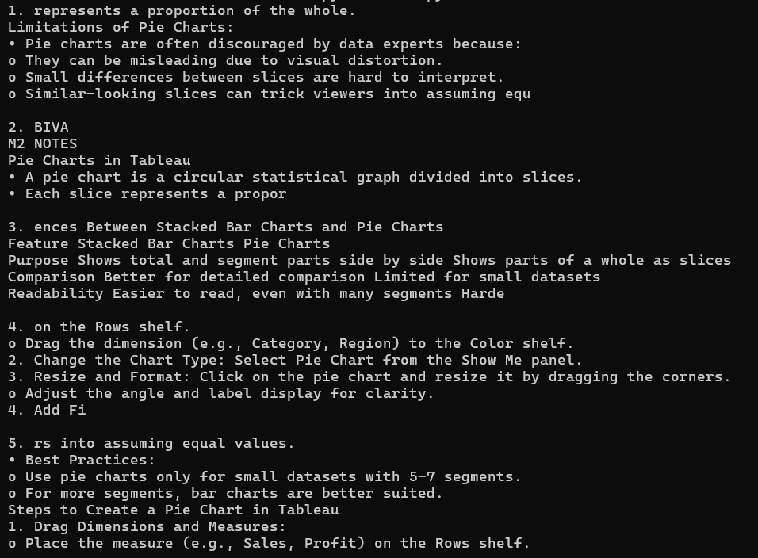

# RAG-PDF-assistant
This project is a simple Retrieval-Augmented Generation (RAG) pipeline that allows users to ask questions about a PDF document. It combines document loading, text splitting, semantic embedding using sentence-transformers/all-MiniLM-L6-v2, vector storage with FAISS, and large language model responses using the Mistral Large API.

Built with LangChain components, the system retrieves relevant document chunks and generates context-aware answers grounded in the content of the PDF.

It uses:
- LangChain for orchestration
- PyPDFLoader for extracting text from PDFs
- Hugging Face embeddings 
- FAISS for vector storage
- Mistral AI (`mistral-large-latest`)

Major Features and Steps Involved:
- Load and process any PDF
- Split text into manageable chunks
- Embed documents into a vector store (FAISS)
- Retrieve relevant sections based on user queries
- Generate LLM responses grounded in the retrieved context

Example:  

